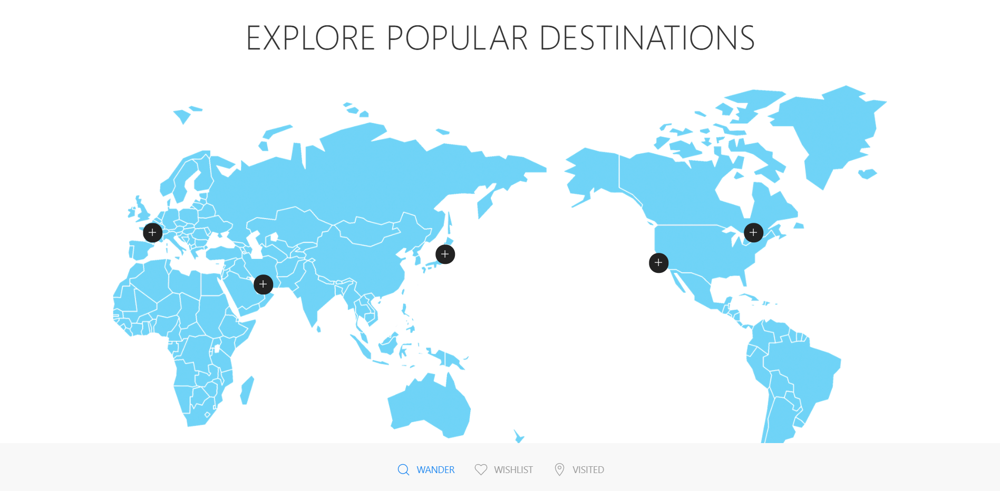

## Wanderful
> Wanderful Travel App

## Table of contents
* [General info](#general-info)
* [Screenshots](#screenshots)
* [Setup](#setup)
* [Status](#status)
* [Contact](#contact)

## General info
This is a web page application that tracks  a user's information regarding where they've traveled and where they wish to travel. Users can save this information to a database and retrieve it at any time they want, this app also uses an API to show the user common tourist activities in a given area.
## Screenshots



## Setup
This application runs in browser. There is no installation needed to run this app.

## Code Examples
 ```
$("#search").on("click", function(event) {
  // preventing default behavior
  event.preventDefault();
  if ($("#visited").text() === "ADDED TO VISITED") {
    $("#visited").text("ADD VISITED");
    $("#visit").toggleClass("deepskyblue");
    console.log("#1");
  } else {
    $("#visited").text("ADD VISITED");
    console.log("#2");
  }
  if ($("#wished").text() === "ADDED TO WISHLIST") {
    $("#wished").text("ADD WISHLIST");
    $("#wish").toggleClass("deepskyblue");
  } else {
    $("#wished").text("ADD WISHLIST");
  }
  // $("#wished").text("Add wishlist");

```

The code block above is an if else statement that switches the "ADD WISHLIST" / "ADD VISITED" elements back to their default states provided that they're not currently already in their default states.


## Status
Project is in progress. Feel free to email us with any suggestions or to report any bugs: amarrokalboffman@gmail.com, sylhuynh76@gmail.com, mcerrillojr13@gmail.com, ianmharris93@gmail.com,


## Contact
Created by Anthony Boffman, Sylvia Huynh, Melvin Cerrillo, and Ian Harris (https://github.com/sylhuynh/wanderful)